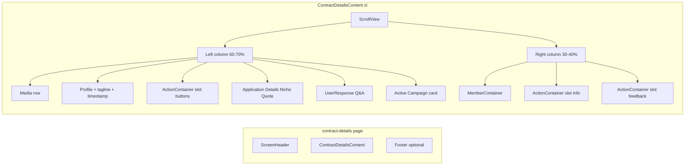

# Contract Details Screen UI Redesign

## Goal

Update [components/contracts/ContractDetailContent.tsx](components/contracts/ContractDetailContent.tsx) to match the uploaded design: proper two-column layout on web (`xl`), clear section labels (e.g. "APPLICATION DETAILS", "Contract Members", "Reviews & Ratings"), card-based presentation, and correct ordering—without removing any content or changing behavior.

## Design-to-Implementation Mapping

| Design element                                   | Current location                                                                                                                              | Action                                                                                                                                                                                                                     |
| ------------------------------------------------ | --------------------------------------------------------------------------------------------------------------------------------------------- | -------------------------------------------------------------------------------------------------------------------------------------------------------------------------------------------------------------------------- |
| Header "Contract Details" + "View Profile"       | [app/(main)/(drawer)/(secondary)/contract-details/[pageID].tsx](app/(main)/(drawer)/(secondary)/contract-details/[pageID].tsx) (ScreenHeader) | No change (already correct).                                                                                                                                                                                               |
| Two cards top: video + profile image             | Single Carousel/ScrollMedia for attachments                                                                                                   | On `xl`: render a row with first attachment (or placeholder) + influencer profile image card. On `!xl`: keep current Carousel/ScrollMedia.                                                                                 |
| Name + "I make videos" + timestamp               | Name + about + timestamp                                                                                                                      | Add tagline line (e.g. from `userData.profile?.content?.about` or `socialMediaHighlight` truncated; with optional icon). Keep timestamp right-aligned.                                                                     |
| APPLICATION DETAILS: Niche + Quote cards         | Quote in UserResponse; no Niche                                                                                                               | New section in ContractDetailContent: label "APPLICATION DETAILS", two grey cards—Niche (from `userData.profile?.category` or "—"), Quote (from `applicationData?.quotation` with currency).                               |
| Campaign idea Q&A card                           | UserResponse Q&A block                                                                                                                        | Keep [UserResponse](components/contract-card/UserResponse.tsx) for Q&A; optionally restyle as single card. No removal of questions/answers.                                                                                |
| Active Campaign card                             | Pressable to collaboration-details                                                                                                            | Add "ACTIVE CAMPAIGN" tag, keep title + description + arrow.                                                                                                                                                               |
| Contract Members + list                          | MemberContainer ("Members")                                                                                                                   | Use MemberContainer; pass title "Contract Members" (add optional `title` prop to [MemberContainer](components/contracts/MemberContainer.tsx)).                                                                             |
| Green info box                                   | ActionContainer bottom block                                                                                                                  | Move to right column on `xl` (see ActionContainer split below).                                                                                                                                                            |
| Reviews & Ratings (From Brand / From Influencer) | ActionContainer feedback cards                                                                                                                | Move to right column on `xl`; add section title "Reviews & Ratings".                                                                                                                                                       |
| Footer copyright                                 | Not present                                                                                                                                   | Add optional footer in [pageID].tsx](app/(main)/(drawer)/(secondary)/contract-details/[pageID].tsx) for web (e.g. when `xl`): "© 2024 Trendly Influencer Management Platform" (or reuse existing footer component if any). |

## Architecture (Two-Column + ActionContainer Split)

- **Mobile (`!xl`)**: Single column, same content order as today (no structural change).
- **Desktop (`xl`)**: Two-column layout; left gets primary content, right gets Members + info box + feedback cards. Action buttons (Start Contract, Ask to Revise, etc.) stay in left column.

## Implementation Steps

### 1. ActionContainer: support slot rendering

**File:** [components/contracts/ActionContainer.tsx](components/contracts/ActionContainer.tsx)

- Add optional prop: `slot?: 'all' | 'buttons' | 'feedback-and-info'` (default `'all'`).
- Keep a single component (one hook, one manager fetch). No new hooks or duplicate fetches.
- When `slot === 'buttons'`: render only the status-based action buttons (Ask to Revise / Start Contract, or End Contract / Go to Messages). No feedback cards, no green info box.
- When `slot === 'feedback-and-info'`: render only the two feedback cards (From Brand, From Influencer) and the green info box at the bottom. Add a "Reviews & Ratings" heading above the feedback cards when this slot is used.
- When `slot === 'all'` or undefined: current behavior (buttons, then feedback cards, then info box).

This allows ContractDetailContent to render `<ActionContainer slot="buttons" ... />` in the left column and `<ActionContainer slot="feedback-and-info" ... />` in the right column when `xl`.

### 2. MemberContainer: optional section title

**File:** [components/contracts/MemberContainer.tsx](components/contracts/MemberContainer.tsx)

- Add optional prop: `title?: string` (default `"Members"`).
- Use `title` for the section header text so the parent can pass `"Contract Members"` to match the design.

### 3. ContractDetailContent: layout and new sections

**File:** [components/contracts/ContractDetailContent.tsx](components/contracts/ContractDetailContent.tsx)

- Use `useBreakpoints()` for `xl` and `width`. Use `Colors(theme)` and a single `StyleSheet.create` (or `useMemo`-based styles) at the bottom of the file; no inline style objects in JSX (align with workspace UI rules).
- **Top media (xl only):** When `xl` and there are attachments, render a row: first attachment (or video placeholder with play icon) + a card with influencer profile image (`userData.profileImage`). When `!xl`, keep existing Carousel/ScrollMedia behavior.
- **Profile block:** Keep name and timestamp; add a tagline line below name (e.g. first line of `userData.profile?.content?.about` or `socialMediaHighlight`, or fallback "—") with optional camera icon to match "I make videos".
- **Application Details section (new):** Only when `applicationData` is present. Section label "APPLICATION DETAILS" (small uppercase grey). Two side-by-side cards on `xl`, stacked on `!xl`:
  - **Niche:** `userData.profile?.category?.[0]` or `category?.join(' & ')` or "—".
  - **Quote:** `applicationData.quotation` with app currency constant (reuse existing pattern from codebase).
- **Left column (xl):** Media row, profile + tagline + timestamp, about text, `<ActionContainer slot="buttons" ... />`, Application Details, `<UserResponse ... />`, Active Campaign card (Pressable with "ACTIVE CAMPAIGN" tag, collaboration name, description, arrow).
- **Right column (xl):** `<MemberContainer title="Contract Members" ... />`, `<ActionContainer slot="feedback-and-info" ... />` (which includes "Reviews & Ratings" + feedback cards + green info box).
- **Single column (!xl):** Current order: media, profile, full `<ActionContainer />`, MemberContainer, UserResponse, Active Campaign card. No duplication of content.
- **Styling:** All styles from theme (e.g. `colors.gray300`, `colors.text`); responsive padding and gaps; card borders and radius to match design. Use existing `stylesFn` from [styles/CollaborationDetails.styles.tsx](styles/CollaborationDetails.styles.tsx) where it already provides shared tokens; add local styles for new sections and two-column wrapper.

### 4. UserResponse: optional styling for Q&A card

**File:** [components/contract-card/UserResponse.tsx](components/contract-card/UserResponse.tsx)

- No structural change required. Optionally wrap the Q&A list in a single card style when used inside ContractDetailContent (or leave as is if design is satisfied by parent padding/card). Ensure no content is removed (attachments, message, Quote in Application Details is separate, Q&A stays here).

### 5. Footer (optional)

**File:** [app/(main)/(drawer)/(secondary)/contract-details/[pageID].tsx](app/(main)/(drawer)/(secondary)/contract-details/[pageID].tsx)

- If design requires the copyright footer: add a small footer view (e.g. only when `xl`) with text "© 2024 Trendly Influencer Management Platform" (or current year), centered, using theme text color. Otherwise skip.

## Data and Behavior Checklist

- All existing props and callbacks unchanged: `refreshData`, `setFeedbackModalVisible`, `setAddMemberModal`, `updateMemberContainer`, navigation to collaboration-details, AddMembersModal, FeedbackModal.
- Niche source: `userData.profile?.category` (array); display first or join with " & ".
- Quote: `applicationData?.quotation`; format with existing currency (e.g. CURRENCY from constants).
- No content removed: application attachments, message, Q&A, feedback cards, members list, info box, action buttons, active campaign link.

## Files to Touch

1. [components/contracts/ActionContainer.tsx](components/contracts/ActionContainer.tsx) — add `slot` prop and conditional rendering.
2. [components/contracts/MemberContainer.tsx](components/contracts/MemberContainer.tsx) — add optional `title` prop.
3. [components/contracts/ContractDetailContent.tsx](components/contracts/ContractDetailContent.tsx) — two-column layout when `xl`, new Application Details section, media row, tagline, all styles in StyleSheet.
4. [app/(main)/(drawer)/(secondary)/contract-details/[pageID].tsx](app/(main)/(drawer)/(secondary)/contract-details/[pageID].tsx) — optional footer when `xl`.
5. [components/contract-card/UserResponse.tsx](components/contract-card/UserResponse.tsx) — optional card styling for Q&A only if needed; otherwise leave unchanged.

## Responsive Summary

- `**xl` (desktop):** Two-column flex row; left ~65–70% width, right ~30–35%; constrained max width and horizontal padding for readability; media as two cards; Niche + Quote side-by-side; ActionContainer split across columns.
- `**!xl` (mobile):** Single column, existing order and behavior preserved.

